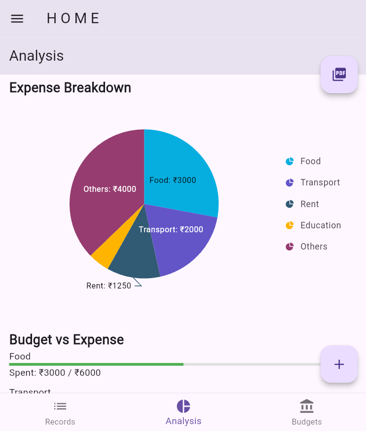
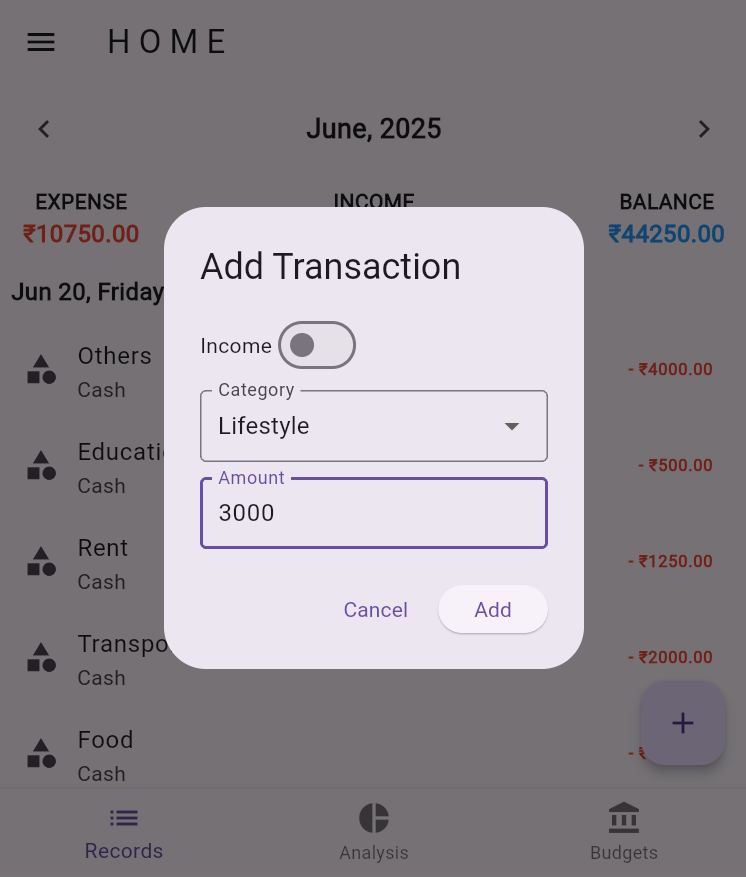
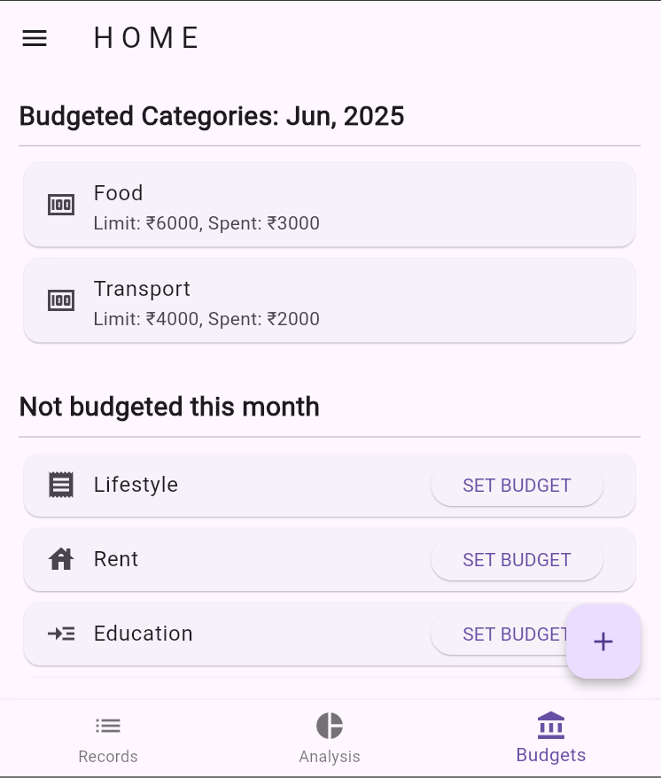
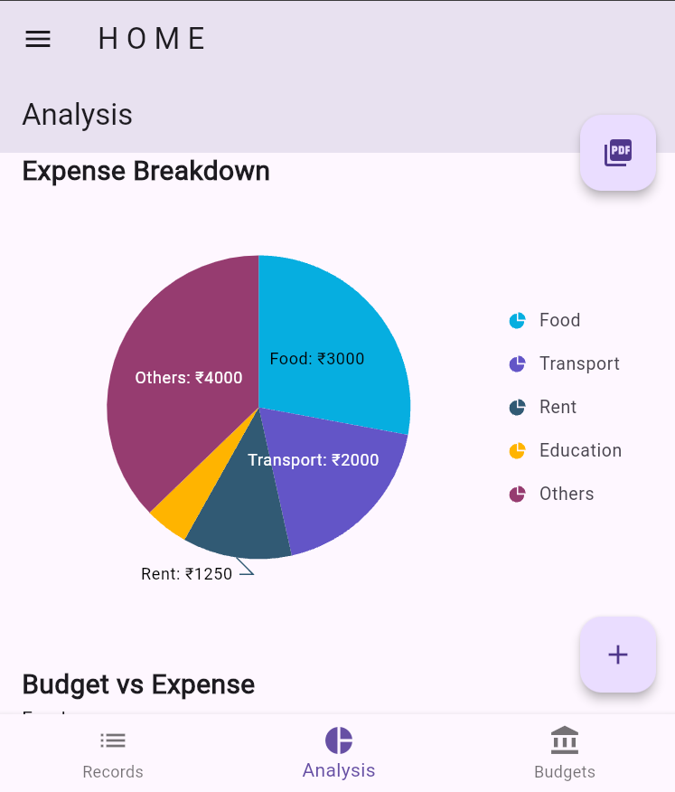

# 💰 Expense Tracker App

A sleek, powerful and intuitive **Expense Tracker Mobile App** built using **Flutter** that helps you manage your finances effortlessly. Track your daily expenses, set monthly budgets, and gain insights through dynamic visualizations. Take full control of your financial life—one transaction at a time.


---

## 📱 Screenshots

| Home | Add Expense | Budget Planner | Visualization |
|------|-------------|----------------|---------------|
|  |  |  |  |

---

## 🚀 Features

### ✅ Expense Tracking
- Add, edit, and delete daily expenses
- Categorize transactions (Food, Transport, Shopping, Bills, etc.)
- View recent and historical transactions

### 📊 Budget Planning
- Set monthly budgets for each category
- Monitor your spending against your budget in real-time
- Get alerts when you're nearing limits

### 📈 Visual Analytics
- Interactive pie charts for category-wise breakdown
- Bar graphs for monthly spending trends
- Insightful dashboards to help you stay on track

### 📅 Date-based Filtering
- Easily browse transactions by day, week, or month
- Filter data by custom date ranges

### ☁️ Offline Support (Optional)
- Works without internet access
- All data stored locally with secure storage

---

## 🛠 Tech Stack

- **Framework:** Flutter (Dart)
- **State Management:** Provider / Riverpod / Bloc *(choose based on your implementation)*
- **UI Components:** Material Design
- **Charts & Graphs:** `fl_chart` / `syncfusion_flutter_charts`
- **Local Database:** `sqflite` / `Hive`
- **Date Handling:** `intl` package

---

## 📦 Installation

### Prerequisites
- Flutter SDK: [Install Flutter](https://flutter.dev/docs/get-started/install)
- Android Studio / VS Code
- Dart SDK

### Steps

```bash
# Clone the repository
git clone https://github.com/yourusername/expense-tracker-flutter.git

# Navigate to the project directory
cd expense-tracker-flutter

# Install dependencies
flutter pub get

# Run the app
flutter run
